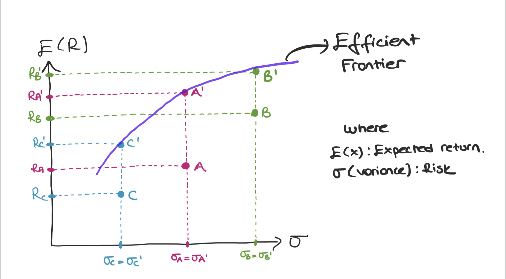

```{r setup, include=FALSE}
knitr::opts_chunk$set(echo = TRUE, warning = FALSE, message = FALSE)
options(scipen = 999)
```

```{r}
library(readxl);library(tidyverse);library(openxlsx);
library(data.table);library(mice);library(knitr);library(kableExtra);
library(quantmod);library(TTR);library(readxl);library(timeSeries);
library(fPortfolio);library(tseries);library(PerformanceAnalytics)
```

In a portfolio, it is necessary to consider the risk as well as the return. The risk of a high-yielding asset can be very high, and if you did not make the right choice, you are very likely to lose. For example, let's say an asset X has a return of 2.5% and a variance of 4%. On the other hand, an asset Y has the same risk, but its return is 3.5%. How does ? Let's see in the graph below.

```{r echo=FALSE, preview=TRUE}

```

If we compare the points A', B' and C' with the points A, B, C on the graph; We see that A and A' have the same risk, but A's provides a higher return. The same is true for other points.

! The investor must be desire to act according to efficient frontier.

For more detailed information on the subject, you can [read the paper](https://www.jstor.org/stable/2975974) by Markowitz, H. (1952).

## Let's apply this to stocks.

Firstly, I selected 10 stocks between 31 December 2019 and 30 December 2021. The stocks I chose are as follows;

*AKBNK, SAHOL, TUPRS, THYAO, KCHOL, SISE, TAVHL, TCELL, HALKB, TTKOM*

### Importing the data
```{r}
data <- read_excel("data.xlsx") # You can access the data on my GitHub.
data <- na.omit(data) 

#I'm checking to see if there are any missing observations.
md.pattern(data)

```

### Calculating the Returns
```{r}

data <- data %>% 
  arrange(Ticker) %>%
  group_by(Ticker) %>%
  mutate(lagClose=shift(Close, 1, type= "lag"),
         perReturn= (Close-lagClose)/lagClose,
         logReturn= log(Close/lagClose)) %>%
 ungroup()

ggplot(data, aes(x=Date, y=perReturn, group= Ticker)) +
  geom_line(color="#80d7cc") +
  theme_minimal() +
  theme(axis.title = element_blank(),
  plot.title = element_text(face = "italic", hjust = 0.5)) +
  geom_hline(yintercept = 0) +
  ggtitle("Per Return")

```

### Summary Statistics
```{r}
#Transpose
t_data <- data %>%
  select(Ticker,Date,perReturn) %>% 
  pivot_wider(names_from = "Ticker", values_from = "perReturn") %>% 
  slice(-1)

dat <- t_data %>% 
  column_to_rownames(var = "Date")

dat_cor <- dat %>% 
  cor()

```

There must be a negative relationship between the correlations. Because the investor has to pass the loss from one stock to the profit from the other. If the correlation is zero (0), it means that there is no relationship between them.

```{r}

dat_vcov <- dat %>% 
  cov(dat) %>% 
  as.data.frame() %>% 
  mutate_all(.funs = function(x) round(x, digits = 4))

dat_summary <- dat %>% 
  pivot_longer(everything()) %>% 
  arrange(name) %>% 
  group_by(name) %>%
  summarise_at(vars(value), list(Min = min, Mean = mean, Max = max, Sd = sd))


# For Turkey Risk Free rate (Rf): 17,7%
rf <- 0.17/250  # Daily risk free rate 

dat_summary <- dat_summary %>% 
  mutate(
    Sharpe = (Mean - rf) / Sd
  ) %>% 
  arrange(Sharpe)

ggplot(dat_summary, aes(x= Sd, y= Mean, color = name, size = Sharpe)) +
  geom_point(alpha = .5) + 
  ggrepel::geom_text_repel(aes(label = paste0(name," (",round(Sharpe, digits = 3),")"))) +
  theme_minimal() +
  theme(legend.position = "none") +
  labs(x = "Risk", y = "Expected Return") 

```

The size of the points here is according to the sharpe ratio.

A high Sharpe ratio means that the portfolio created is resistant to risks, and a low one means that the portfolio created is open to risks. Among the 10 stocks I chose, `r dat_summary %>% dplyr::filter(Sharpe == min(Sharpe)) %>% pull(name)` is the most open to risk.

`r dat_summary %>% slice(8) %>% pull(name)` and `r dat_summary %>% slice(9) %>% pull(name)` have relatively close risks to each other. `r dat_summary %>% slice(5) %>% pull(name)` has similar risks in `r dat_summary %>% slice(7) %>% pull(name)` and `r dat_summary %>% slice(6) %>% pull(name)`. `r dat_summary %>% dplyr::filter(Sharpe == max(Sharpe)) %>% pull(name)` is the most risk-resistant stock with the highest ratio. If we choose the best 2 stocks;

*1st* `r dat_summary %>% dplyr::filter(Sharpe == max(Sharpe)) %>% pull(name)`

*2nd. It is* `r dat_summary %>% slice(9) %>% pull(name)`

### Let's create two stock portfolios and choose a portfolio among them.
```{r}

sharpe <- NULL
stock1 <- NULL
stock2 <- NULL
weights <- seq(0.1,0.9,0.1)

for (j in 1:length(colnames(dat))) { 
  for (i in 1:length(colnames(dat))) { 
    
    if(i != j) {
      x <- dat[,j] 
      y <- dat[,i] 
      
      for (w.x in weights) { 
        
        w.y <- 1 - w.x
        
        p_Return <- mean(x) * w.x + mean(y) * w.y
        p_Risk <- (var(x) * w.x^2 + var(y) * w.y^2 + 2 * w.x * w.y * cov(x,y))^0.5
        
        temp.sharp <- (p_Return - rf) /  p_Risk
        
        sharpe <- c(sharpe, temp.sharp)
        stock1 <- c(stock1, colnames(dat)[j])
        stock2 <- c(stock2, colnames(dat)[i])
        
        rm(temp.sharp, p_Return, p_Risk, w.stock2)
      }
      rm(x,y)
    }
  }
}


weight_1 <- rep(weights,length(sharpe)/length(weights))
sharpe.result <- data.frame(cbind(stock1,weight_1,stock2,sharpe))
sharpe.result$sharpe <- as.numeric(as.character(sharpe.result$sharpe))

sharpe.result <- sharpe.result[order(sharpe.result$sharpe, decreasing = TRUE),]


# We've added a Risk and Return column below.
sharpe.result$Return <- NA
sharpe.result$Risk <- NA

for(i in 1:nrow(sharpe.result)){
  
  stock_1 <- sharpe.result[i,1]
  stock_2 <- sharpe.result[i,3]
  
  stock_1_ret <- dat[[stock_1]]
  stock_2_ret <- dat[[stock_2]]

  stock_1_w <- as.numeric(sharpe.result[i,2])
  stock_2_w <- 1 - stock_1_w

  sharpe.result$Return[i] <- mean(stock_1_ret) * stock_1_w + mean(stock_2_ret) * stock_2_w
  
  sharpe.result$Risk[i] <- (var(stock_1_ret) * stock_1_w^2 + var(stock_2_ret) * stock_2_w^2 + 2 * 
                              stock_1_w * stock_2_w * cov(stock_1_ret,stock_2_ret))^0.5
}


new_plot_df <- sharpe.result %>% 
  select(Return,Risk) %>% 
  bind_rows(
    data.frame(
      Return = dat_summary$Mean,
      Risk = dat_summary$Sd
    )
  ) %>% 
  mutate(
    colgr = c(rep("2 Stocks Portfolios",810),rep("Single Stock Portfolio",10))
  )

```

### Let's show it in a risk-return graph where we compare portfolios of two stocks and portfolios of single stocks.

```{r}

ggplot(new_plot_df, aes(x = Risk, y = Return, color = colgr)) +
  geom_point() +
  theme_minimal() +
  theme(legend.title = element_blank(),
        legend.position = "top",
        plot.title = element_text(face = "italic", hjust = 0.5)) +
  labs(x = "Risk", y = "Expected Return") +
  scale_color_manual(values = c("gray","red")) +
  labs(title = "Two Stocks Portfolios vs Single Stock Portfolio") 
```


### Let's determine the optimal portfolio with:

* 10 assets

* $W_{i} ≥ 0$

```{r}
stock10 <- data.frame(
  matrix(data = "", nrow = 1, ncol = 10)
) %>% 
  `colnames<-`(names(dat))

for(i in 1:100){  #Here, we weighed it 100 times differently.
  
  rnd <- wakefield::probs(10)
  
  for(j in 1:ncol(stock10)){
    
    stock10[i,j] <- rnd[j]
    
  }
  
}

stock10 <- stock10 %>% 
  mutate_if(is.character, as.numeric) %>% 
  mutate_all(function(x) round(x, digits = 2)) %>% 
  distinct() %>% 
  mutate(ExpectedReturn = "",
         Risk = "",
         SharpeRatio = "")

for(k in 1:nrow(stock10)){
  
  portfolio_daily_returns <- Return.portfolio(dat, weights = as.numeric(stock10[k,c(1:10)]))
  expectedReturn <- mean(portfolio_daily_returns$portfolio.returns)
  risk <- sd(portfolio_daily_returns$portfolio.returns)
  
  sharpe_ratio <- round(
  SharpeRatio(portfolio_daily_returns, Rf = 0.177/250), 4
) %>% 
    .[[1]]
  
  stock10[k,11] <- expectedReturn
  stock10[k,12] <- risk
  stock10[k,13] <- sharpe_ratio
  
}

stock10 <- stock10 %>% 
  mutate_if(is.character,as.numeric) %>% 
  mutate(MaxReturnPortfolio = ifelse(ExpectedReturn == max(ExpectedReturn),"MaxReturn","Others"))

ggplot(stock10, aes(x = Risk, y = ExpectedReturn, color = MaxReturnPortfolio)) +
  geom_point() +
  theme_minimal() +
  theme(legend.title = element_blank()) +
  scale_color_manual(values = c("red","gray"))

myPortfolio <- stock10 %>% 
  dplyr::filter(MaxReturnPortfolio == "MaxReturn")

```

The red dot here is the best portfolio.

```{r echo=FALSE}

myPortfolio %>% 
  select(1:10) %>% 
  kbl() %>% 
  kable_styling()

myPortfolio %>% 
  select(11:13) %>% 
  kbl() %>% 
  kable_styling()
  

```
