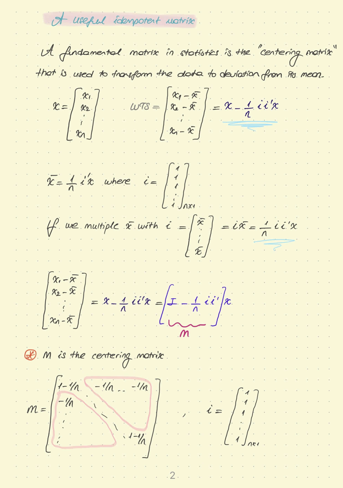

```{r setup, include=FALSE}
knitr::opts_chunk$set(echo = FALSE)
```

I think theoretical knowledge about econometrics is very important. For example, we can do regression analysis with a simple code by building a model, but what is this analysis? what does it do? What is betafdfdf in the model? I think the questions are much more important. If we can understand this part well, we will get more accurate results when coding and interpreting analysis.

In addition to finance, in this series that I have just started, I will both prove and show practically about econometrics.

I hope that will be useful!

*And I hope you like theoretical econometrics!*

```{r}




```

I'll continue with linear algebra in the next post. I'll do it practically later.
